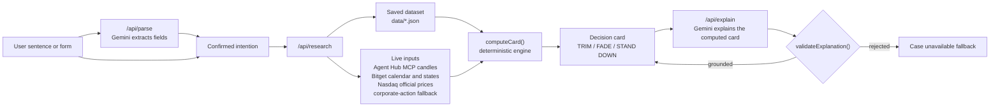

# Reanchor

**A weekend quote. A Monday decision.**

Reanchor is a research desk for one weekend decision on Bitget rTokens. A holder or buyer states what they intend to do (hold and consider a trim, buy a weekend dip, or sell held tokens into a weekend rise). Reanchor tests that intention against what happened at prior US market reopenings, sizes it against real weekend trading activity, quotes Bitget's rule for unfilled weekend limit orders, and returns one rule-based action with every number sourced. It sends no orders. The person decides.

Built for the **Bitget AI Base Camp Hackathon S2**, track **AI Trading Desk**.

| | |
| --- | --- |
| Live app | [reanchor-nine.vercel.app](https://reanchor-nine.vercel.app) |
| Desk | [reanchor-nine.vercel.app/desk](https://reanchor-nine.vercel.app/desk) |
| Method and evidence | [reanchor-nine.vercel.app/method](https://reanchor-nine.vercel.app/method) |
| Source code | [github.com/TheWeirdDee/reanchor](https://github.com/TheWeirdDee/reanchor) |

## How Reanchor works

Reanchor turns a weekend intention into a checked decision:

**Describe → Confirm → Stress-test → Decide**

1. **Describe.** Type the trade in your own words, or fill the structured form. A language model (Google Gemini) only extracts fields: instrument, intent, holding, trade size and limit price. A price you mention is treated as your proposal, never as market data.
2. **Confirm.** Extracted fields are marked "From your text" and stay editable. Research runs only on the intention you confirm; any edit clears the confirmation.
3. **Stress-test.** A deterministic engine checks the session, data freshness, corporate actions, turnover, sample size, holdings and the order band, then compares the current weekend move with prior weekends whose reopening is already known. It sizes the clip against weekend turnover and models fees and slippage.
4. **Decide.** The desk returns one action, **TRIM**, **FADE** or **STAND DOWN**, with the reasons, the modeled size, Bitget's weekend order rule, a hypothetical scenario and every source with its timestamp. STAND DOWN is a full answer: it says the evidence does not support acting, and why.

The language model never chooses the action, the size or the evidence. If it is unavailable, the form and every computed result still work.

## See it in action

In one sentence: Reanchor takes "I hold 2,000 USDT of rNVDA and want to check whether to trim", replays the rules on real Bitget data as of Sunday 20:00 ET, finds that only 1 of 9 comparable prior weekends matched (3 are required), stands down, and then shows what actually happened at Monday's reopening.

The real replay of the weekend after Friday 25 September 2026 (rNVDA, Hold intent, 2,000 USDT holding):

| Observation | Time (New York) | Value | Source |
| --- | --- | --- | --- |
| Friday reference (token) | Fri 2026-09-25 20:00 ET | 225.00 USDT | Bitget 15m bar ending at the weekend start |
| Sunday decision quote (token) | Sun 2026-09-27 20:00 ET | 223.55 USDT (-0.64%) | Bitget 15m bar ending at the inferred transition |
| Extreme-move threshold | from 9 eligible prior weekends | 0.61% | 70th percentile of prior absolute weekend moves |
| Matched extreme weekends | | 1 (3 required) | Same direction, beyond threshold |
| Decision | | **STAND DOWN** | Computed by `computeCard()` |
| Monday reopening (token) | Mon 2026-09-28 09:30 ET | 229.56 USDT (+2.69%) | Revealed after the decision, never used by it |
| First-hour end (token) | Mon 2026-09-28 10:30 ET | 231.27 USDT (+3.45%) | Revealed after the decision |
| NVDA official close / open | 2026-09-25 / 2026-09-28 | 225.07 / 229.75 USD | Nasdaq.com historical quotes, kept separate from token prices |
| Weekend turnover proxy H_t | before the decision | 4,474 USDT/h | Median of the three prior weekend-session medians |

One weekend is not a forecast or a track record. It does not show that standing down was right.

## Surfaces

| Surface | What it shows |
| --- | --- |
| Landing (`/`) | The weekend gap, the three session moments, a workflow demo, the real replay above with its price sequence (missing bars stay missing), the evidence map, limitations derived from the saved records, and an FAQ. |
| Desk (`/desk`) | Natural-language input and structured form, confirmation, live or replay mode, the decision card, the historical stress-test table with baseline comparison, the replayed outcome, a hypothetical scenario, and sources with timestamps. |
| How it works (`/how-it-works`) | The eight-step journey using the real replay's values. |
| Method and evidence (`/method`) | Anchored sections: coverage, sessions and calendar, weekend measurement, turnover denominator, signals and intent mapping, sizing and costs, chronological evaluation, source provenance, integration status, assumptions and open questions. |
| About (`/about`) | Who it serves, the decision it helps with, what it will not do, and its research stage. |

Every count, date, price and status on the public pages is read at request time from the saved records through one server presentation model (`src/server/presentation.ts`), which reloads when the data or evidence files change. No figure is typed into page copy.

## The problem

Bitget rTokens trade over the weekend while the US stock market is closed. A weekend quote is an indication, not Monday's stock price. Three moments matter, and they carry different levels of evidence:

| Moment | Time | Evidence |
| --- | --- | --- |
| Weekend book opens | Friday 20:00 ET | Documented by Bitget support |
| Weekend quotes end, overnight session begins | Sunday 20:00 ET | Inferred from Bitget's Reality calendar, market states and candles; not stated by Bitget as one sentence |
| Regular session reopens | Monday 09:30 ET | Verified: turnover steps up at least fivefold exactly at the 09:30 ET bar in 23 of 23 rNVDA weekends |

Bitget's documented rule for unfilled weekend limit orders: *"Unfilled limit orders placed during the weekend will be automatically canceled when the system switches back to regular trading on Monday's US stock market open."* (support article 12560603892041, FAQ 13; saved copy in `evidence/sources/`). No Bitget source gives a timestamp for that cancellation, so Reanchor shows **"Cancellation timing not verified"** and never displays a cancellation deadline.

## Decision engine

The engine in `src/domain` is pure and deterministic. The same inputs always give the same card.

**Measurement.** For each weekend: the Friday reference is the close of the 15-minute bar ending at the weekend start; the decision price is the close of the latest closed bar at the decision time (Sunday 20:00 ET in replays); the reopening is the open of the bar starting at 09:30 ET; the endpoint is the close of the bar ending at 10:30 ET. Missing bars are never filled.

**Signal.** Only weekends whose first regular-session hour ended before the decision are visible. At least 6 eligible prior weekends are required. A move is extreme beyond the 70th percentile of their absolute weekend moves. At least 3 same-direction extreme weekends must exist; their median total return decides reversal or continuation, and if fewer than two thirds share the median's sign the sample is conflicting.

**Intent mapping.**

| Intent | Acts only when | Action |
| --- | --- | --- |
| Hold | An extreme weekend rise that prior weekends reversed | TRIM: model selling up to 25% of the holding |
| Buy the dip | An extreme weekend fall that prior weekends reversed | FADE: model a spot buy |
| Sell into a pop | An extreme weekend rise that prior weekends reversed, with enough holdings | FADE: model a sale of tokens you hold |
| Any | Anything else, or any failed check | STAND DOWN, with the reasons |

**Hard failures that force STAND DOWN:** outside a verified weekend session; Bitget closure calendar not reconciled with the NYSE calendar; nonstandard weekend (holiday or early close); session clock not verified; missing Friday reference or decision bar; decision price older than 45 minutes; corporate action not clear; turnover denominator unavailable; fewer than 6 eligible prior weekends; missing limit price or holdings; limit outside the approximate placement band; proposed clip above 25% of H_t.

**Sizing and costs.** H_t is the median of the last three weekend-session medians of hourly quote turnover, each from at least 6 complete hours strictly before the decision. The modeled clip is capped at 10% of H_t, floored to the instrument's precision and minimum order. Costs are assumptions: a 0.10% fee per fill, plus 5 bps of slippage up to 5% participation and 15 bps up to 10%. Whether a weekend limit would have filled is reported as UNKNOWN.

## Bitget AI integration

| Integration | Role in Reanchor | Status |
| --- | --- | --- |
| **Bitget Agent Hub MCP** (`@bitget-ai/bitget-agent-mcp` 3.3.1, official, read-only, no credentials) | Supplies the live desk's 15-minute rToken candles through the MCP `market` tool, and cross-checks the saved dataset | Working. Latest cross-check: 6/6 real calls OK and 6/6 values match the dataset (2026-10-07 00:13 UTC, `data/agent-tool-receipts.json`, earlier runs kept). Verified on the Vercel deployment: live candles come from Agent Hub. |
| **Bitget AI data MCP** (`agent.bitget.com/mcp`) | Intended source for corporate actions and earnings dates | Unavailable on Bitget's side. The server connects and its catalog call succeeds, but every research query returns Bitget's "503 Service Temporarily Unavailable" page (29 recorded probe attempts; latest 2026-10-07 00:51 UTC in `evidence/mcp-probe-log.json`). |
| Bitget public API v3 | Historical 15-minute candles for the verified snapshot; direct fallback for live candles | Working |
| Bitget Reality calendar and market states | Weekend session windows and holiday closures | Working |
| Bitget split records plus Nasdaq.com dividend history | Labeled fallback for corporate actions while the data MCP is down | Working; every card says which source it used |

Agent Hub provides public market data only. Reanchor does not use it, and does not claim to use it, for corporate actions, earnings dates or stock prices.

## Language model role and authority separation

| Job | What the model does | What it cannot do |
| --- | --- | --- |
| Intent extraction (`/api/parse`) | Fills instrument, intent, holding, trade size and limit price from your sentence, and lists ambiguities | Its output schema has no action field. Nothing runs until you confirm the fields. |
| Case explanation (`/api/explain`) | Writes a short explanation of an already computed card | `validateExplanation()` rejects any text that states a different action, uses a number not on the card, or gives a cancellation time. A rejected or failed explanation shows "Case unavailable. Computed results remain available." |

The model is Google Gemini `gemini-3.5-flash-lite`, called server-side with `GEMINI_API_KEY`. HTTP 429 and other failures fall back to the structured form or the case fallback without retries. The UI never says the AI decided anything.

## Evidence and validation

| Item | Result |
| --- | --- |
| Candidate rTokens | 7 verified Bitget Reality spot instruments: rNVDA, rTSLA, rAAPL, rMSFT, rAMZN, rMETA, rQQQ |
| Supported for research | **rNVDA only** (23 weekends seen, 10 boundary-complete, 12 turnover-eligible sessions). The others lack enough complete weekends or usable weekend turnover; each reason is listed on `/method#coverage`. |
| Replay rows | 69 = 23 weekends x 3 intents x 1 instrument |
| Chronological evaluation | 4 weekends evaluated after warm-up, below the 8 needed for any headline rate, so results are exploratory |
| Outcome | All 69 replay rows were STAND DOWN; no FADE or TRIM was produced. In the 4 evaluated weekends, 3 moves were not extreme and 1 had too few matched weekends (at most 1 matched, 3 required). |
| Holdout | rQQQ was designated as holdout but does not meet the data gate, so holdout validation is unavailable |
| Reproducibility | `npm run evidence:verify` recomputes all 23 weekend rows and all 69 evaluation rows from the saved bars, and checks the manifest hashes of 11 data files |

The four evaluated weekends (Hold intent):

| Weekend (Saturday) | Weekend move | Threshold | Eligible prior | Matched | Result |
| --- | --- | --- | --- | --- | --- |
| 2026-08-29 | +0.09% | 0.93% | 6 | 1 | STAND DOWN: move not extreme |
| 2026-09-12 | -0.59% | 0.75% | 7 | 1 | STAND DOWN: move not extreme |
| 2026-09-19 | -0.09% | 0.63% | 8 | 1 | STAND DOWN: move not extreme |
| 2026-09-26 | -0.64% | 0.61% | 9 | 1 | STAND DOWN: 1 matched, 3 required |

The rules were fixed before the evaluation was run and were not tuned to produce a trade. The evidence does not establish a trading edge, and Reanchor does not claim one.

## Reliability and fail-closed behavior

- **Confirmation gate.** Research runs only on a confirmed intention; any edit clears the confirmation.
- **Fail closed.** A missing bar, stale quote, unreconciled calendar, unknown corporate action or unavailable turnover gives STAND DOWN with the reason, never a guess.
- **No substitution.** A failed live source is shown as failed. A token price is never used in place of the stock's official price, and the stock-linked scenario is disabled when the official close is unknown.
- **Labeled fallbacks.** When Agent Hub is unavailable, live candles come from the direct Bitget API and the source says so. When the data MCP is unavailable, corporate actions come from the labeled fallback.
- **Strict chronology.** The cohort and H_t use only data that existed before the decision time; the replayed outcome is revealed afterwards and never used.
- **Receipts.** Agent Hub calls, data MCP probes and refresh attempts are saved with timestamps and content hashes; earlier runs are kept, not overwritten.
- **Synthetic isolation.** Synthetic fixtures live only in `tests/fixtures/`; `npm run evidence:verify` fails if production code imports them or saved data contains synthetic symbols.

## Failure and recovery case studies

Both cases below were observed on this project, not constructed.

### 1. Bitget AI data MCP returns HTTP 503 → labeled corporate-action fallback

Trigger: the pipeline and the desk query the data MCP for corporate actions and earnings dates. The server connects and lists its tools; the research query fails. Latest probe record (`evidence/mcp-probe-log.json`):

```json
{
  "at": "2026-10-07T00:51:09.691Z",
  "connected": true,
  "tools": ["guide", "do_query"],
  "guide": "OK (5 categories)",
  "doQuery": { "outcome": "ERROR", "statusCode": 503 }
}
```

Recovery: corporate actions use Bitget split records plus Nasdaq.com dividend history, labeled "Corporate actions (fallback)" on every card and on `/method#integrations`. Earnings dates are shown as unavailable. The outage is disclosed, not hidden, and the fallback never claims to be MCP data.

### 2. Agent Hub MCP could not start on Vercel → direct API fallback → fixed

Trigger: the first Vercel deployment started the Agent Hub MCP server as a separate Node process, but the deployment bundle did not include that process's own dependencies. The deployed desk reported, on 2026-10-07:

```text
Token 15m candles: OK | Bitget /api/v3/market/candles (direct fallback) | 999 closed bars; Agent Hub MCP unavailable: MCP error -32000: Connection closed
```

Recovery: the live desk kept working on real Bitget data through the labeled direct fallback. The fix in `next.config.ts` computes the Agent Hub package's full dependency closure (93 packages) and ships it with the API routes. Verified locally by starting Agent Hub from only the files the bundle ships, then on the redeployed site:

```text
Token 15m candles: OK | Bitget Agent Hub MCP market.candles (official AI tool, read-only, no credentials) | 999 closed bars
```

## Architecture



## Repository map

| Component | Source |
| --- | --- |
| Decision engine | `src/domain/decision.ts` (`computeCard`) |
| Signal and cohort | `src/domain/signal.ts`, `src/domain/episodes.ts` |
| Session calendar | `src/domain/calendar.ts`, `src/domain/time.ts` |
| Turnover denominator H_t | `src/domain/turnover.ts` |
| Sizing, costs, scenario | `src/domain/sizing.ts`, `src/domain/accounting.ts`, `src/domain/scenario.ts` |
| Intent validation | `src/domain/intent.ts` |
| Research service | `src/server/service.ts`, `src/server/research.ts` |
| Live inputs | `src/server/live.ts` |
| Agent Hub MCP client | `src/server/agent-mcp.ts` |
| Bitget AI data MCP client | `src/server/mcp.ts` |
| Bitget and Nasdaq adapters | `src/server/bitget.ts`, `src/server/nasdaq.ts`, `src/server/corporate-fallback.ts` |
| Model provider and jobs | `src/server/llm-provider.ts`, `src/server/model.ts`, `src/server/facts.ts` |
| Presentation model | `src/server/presentation.ts` |
| API routes | `src/app/api/parse`, `src/app/api/research`, `src/app/api/explain`, `src/app/api/meta` |
| Desk UI | `src/components/desk/` |
| Public pages | `src/app/page.tsx`, `src/app/how-it-works`, `src/app/method`, `src/app/about` |
| Data pipeline | `scripts/discover.ts`, `scripts/ingest.ts`, `scripts/validate-dataset.ts`, `scripts/build-replay.ts` |
| Audits and verification | `scripts/agent-mcp-crosscheck.ts`, `scripts/mcp-probe.ts`, `scripts/model-check.ts`, `scripts/audit-g2-g3.ts`, `scripts/verify-evidence.ts`, `scripts/audit-all.ts` |
| Saved data | `data/` |
| Run records and evidence | `evidence/` |
| Documentation | `docs/` |

## Prerequisites

- Node.js 20.9 or newer (built with Node 24.13.1)
- npm

## Configuration

```bash
cp .env.example .env.local
```

| Variable | Required | Purpose |
| --- | --- | --- |
| `GEMINI_API_KEY` | For natural-language input and explanations | Server-side Gemini key. Without it, the structured form and every computed result still work. |
| `REANCHOR_MODEL_PROVIDER` / `REANCHOR_MODEL` | No | Default `gemini` / `gemini-3.5-flash-lite`. `openai-compatible` is also supported. |
| `REANCHOR_OPENAI_BASE_URL` / `REANCHOR_OPENAI_API_KEY` | Only for `openai-compatible` | Endpoint and key for an OpenAI-compatible provider. |
| `REANCHOR_LLM_DISABLED` | No | `1` disables every model call. |
| `REANCHOR_SITE_URL` | For a public deployment | Public https origin. Enables canonical links, the social image URL, sitemap entries and indexing. Ignored if it is not https or points at localhost. Set it before building. |

All variables are server-side; none uses the `NEXT_PUBLIC_` prefix, so none reaches the browser. Bitget needs no credentials: every Bitget call is public and read-only.

## Running Reanchor

```bash
npm install
npm run build
npm run start            # http://localhost:3000
```

The repository includes the verified snapshot in `data/*.json`, so the app runs without re-ingesting.

## Verification

| Command | Network | What it checks | Latest result |
| --- | --- | --- | --- |
| `npm run typecheck` / `npm run lint` | None | TypeScript and ESLint | Pass |
| `npm test` | None | 85 Vitest tests across 8 files: calendar, candles, episodes, signal and decision (including TRIM and FADE paths), sizing and accounting, adapters, model validation, provider configuration, site metadata, path redaction | 85 passed |
| `npm run test:e2e` | Live-mode test only | Playwright flows at 1280, 768 and 390 px, plus a five-width desk layout check (1440, 1280, 1024, 768, 390) | 51 passed, 6 deliberately skipped (three tests run at one width only) |
| `npm run evidence:verify` | None | Manifest hashes, recomputation of every saved row, Agent Hub receipts, turnover units, synthetic isolation, emoji and secret scans, client-bundle check | 10 of 10 checks passed |
| `npm run agent:crosscheck` | Bitget Agent Hub MCP | Real read-only Agent Hub calls compared with the saved dataset | 6/6 calls OK, 6/6 values match |
| `npm run mcp:probe` | Bitget AI data MCP | Single availability probe, appended to `evidence/mcp-probe-log.json` | HTTP 503 on research queries |
| `npm run model:check` | Model provider | Verifies the configured model and makes one tiny real call | Verified |
| `npm run audit:g2g3` | None | Episode-level audit and sensitivity runs | Pass |
| `npm run audit:all` | All of the above | Runs every check in gate order and writes `evidence/audit-run.json` | 12 of 12 steps passed (2026-10-07 00:13 UTC) |

Data pipeline commands: `npm run data:discover`, `npm run data:ingest`, `npm run data:mcp`, `npm run data:validate`, `npm run data:replay`. They never overwrite a valid snapshot with a failed run.

## Deployment

The app is a standard Next.js server app (Node.js runtime, no Edge routes) and is deployed on Vercel from this repository.

- **Runtime files.** Pages and API routes read `data/*.json` and three evidence files at runtime. `next.config.ts` lists them in `outputFileTracingIncludes`, together with the Agent Hub MCP package and its dependencies for the API routes; screenshots are excluded. Nothing is written to disk at runtime; caches are in memory.
- **Environment.** Set `GEMINI_API_KEY` and `REANCHOR_SITE_URL` in the Vercel project, then redeploy.
- **Data refresh.** Run the pipeline scripts locally and commit the results; the deployed app never ingests.

## Limitations

- Weekend rToken prices are indicative Bitget quotes, not Nasdaq transactions. The token can keep a basis to the stock after the reopening.
- Samples are small and recent. Minimum counts are reporting floors, not statistical significance. Historical resemblance is not a forecast.
- H_t is an activity proxy from weekend candle turnover, not order-book depth. Fees and slippage are assumptions. Limit fills are UNKNOWN.
- Weekend trading on Bitget is sparse. The latest closed weekend bar is often older than the 45-minute freshness limit, in which case live mode stands down.
- Live mode has been verified on real Bitget data outside the weekend session, where it correctly stands down. A live decision inside an open weekend session has not yet been observed; in-session decisions use the same `computeCard()` engine verified on recorded weekends.
- Cancellation timing of unfilled weekend limits is not verified; only Bitget's rule is documented.
- The Bitget AI data MCP is unavailable on Bitget's side; corporate actions use the labeled fallback and earnings dates are unavailable.
- Bitget and Nasdaq redistribution terms have not been verified. Raw provider responses (`data/raw/`) are excluded from version control.
- No orders, accounts, keys or trading paths exist in this codebase. No user study has been run yet.

Further reading: `docs/METHOD.md`, `docs/DATA_GATE.md`, `docs/CLAIM_LEDGER.md`, `docs/VALIDATION.md`, `docs/GATES.md`, `docs/audit/G2_G3_AUDIT.md`, `docs/BUILD_REPORT.md`. The product contract is `docs/PRD.md`.

## Acknowledgments

- Market data and AI tooling: Bitget public API, Bitget Agent Hub MCP and Bitget AI MCP
- Official stock prices and dividend history: Nasdaq.com historical quotes
- Language model: Google Gemini
- Framework: Next.js, with GSAP for motion
